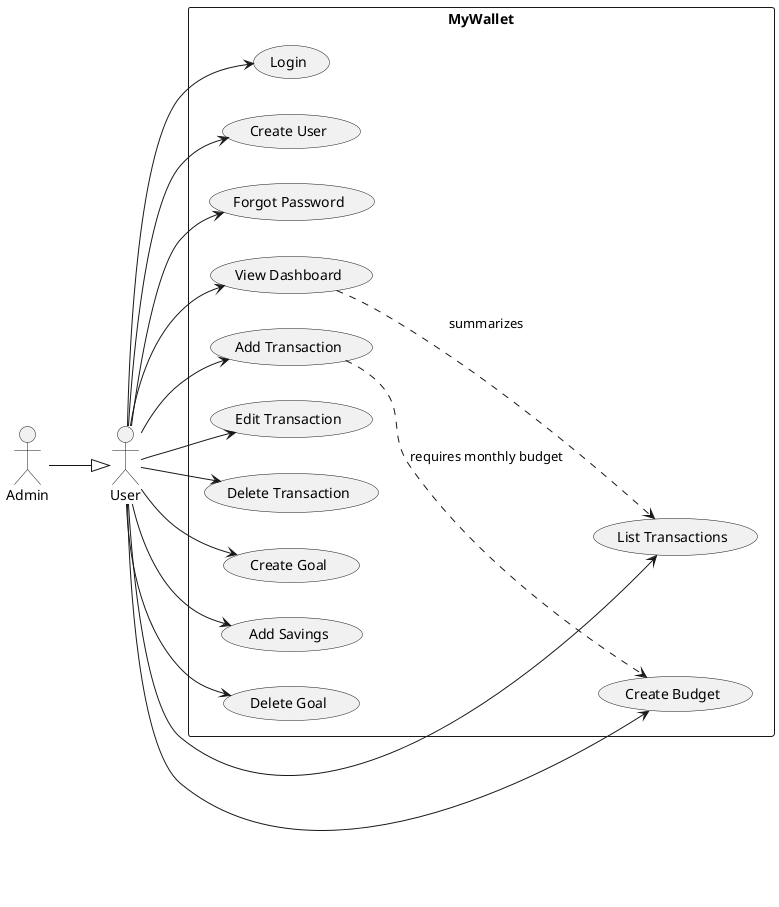
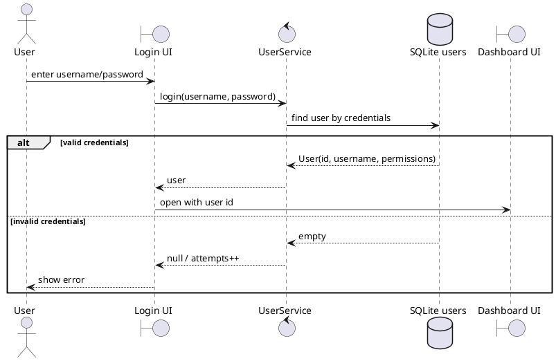
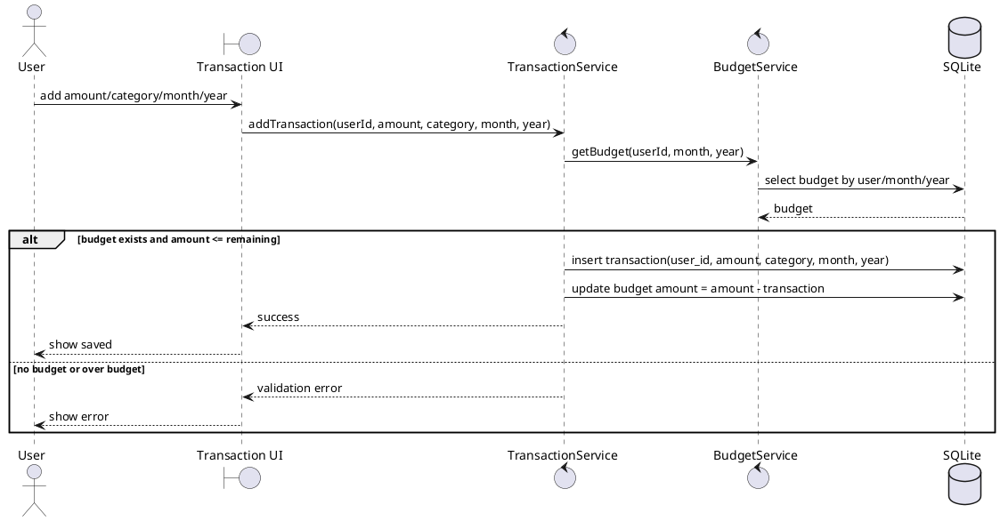
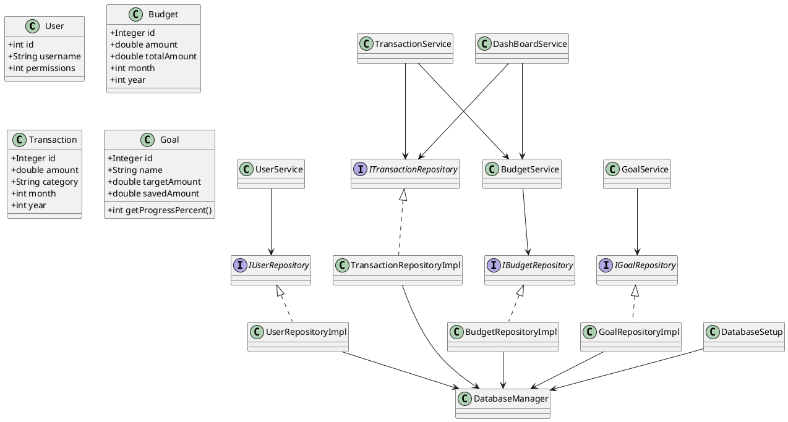
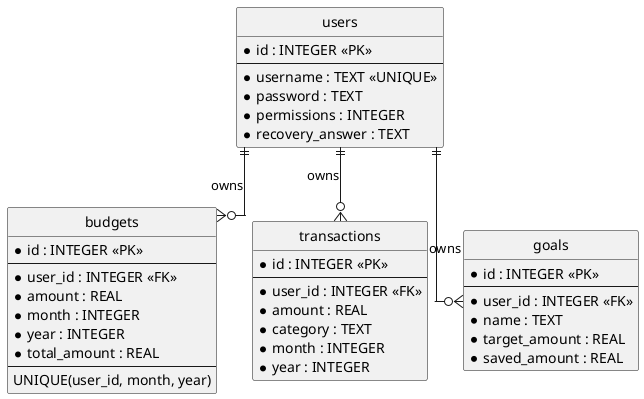
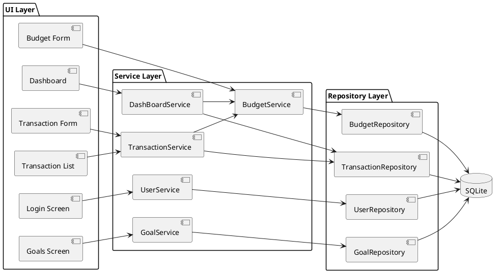

# MyWallet

MyWallet is a personal finance tracker with two local-first apps:

- `money_track`: Java Swing desktop app with SQLite.
- `mywallet_android`: Native Android Java app with SQLite.

Both apps support login, create user, forgot password, monthly budgets, transactions, savings goals, and multi-user data separation.

## Project Structure

```text
MyWallet/
|-- .github/workflows/
|   |-- build.yml
|   `-- build_android.yml
|-- docs/
|-- money_track/          Java Swing desktop app
|-- mywallet_android/     Android app
`-- README.md
```

## Build Desktop

```powershell
cd C:\Users\D4RK\Documents\Git\MyWallet\money_track
mvn test
mvn exec:java
```

Desktop CI builds installers with `.github/workflows/build.yml`.

## Build Android

```powershell
cd C:\Users\D4RK\Documents\Git\MyWallet\mywallet_android
.\build_debug.bat
```

Debug APK:

```text
mywallet_android/app/build/outputs/apk/debug/app-debug.apk
```

Android CI builds the APK with `.github/workflows/build_android.yml`.

## Seed Users

```text
admin / 1234
user / user
zaid / zaid
hamza / 9999
```

For seeded users, the recovery answer is the username.

## Use Case Diagram



## Login Sequence



## Transaction Sequence



## Class Diagram



## Database Schema



## Services Diagram



## GitHub Actions

- `build.yml`: builds desktop installers for Windows, Linux, and macOS.
- `build_android.yml`: builds the Android debug APK.

